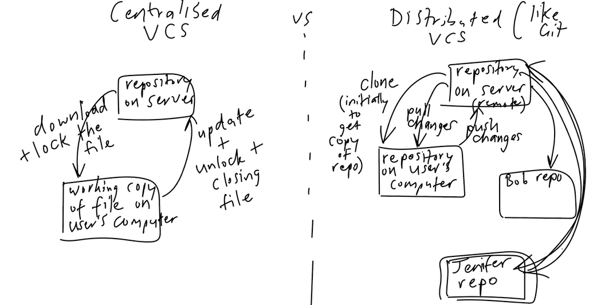
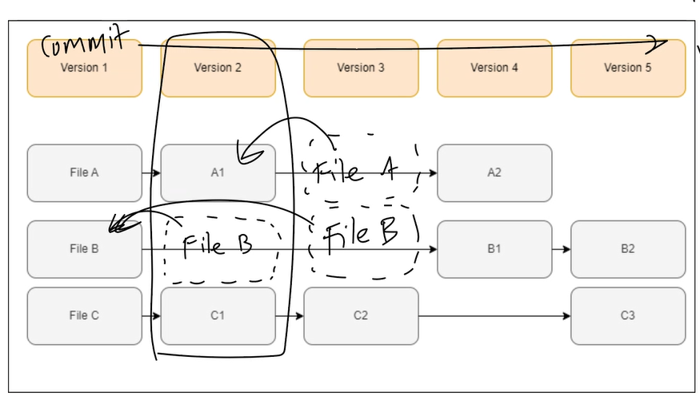
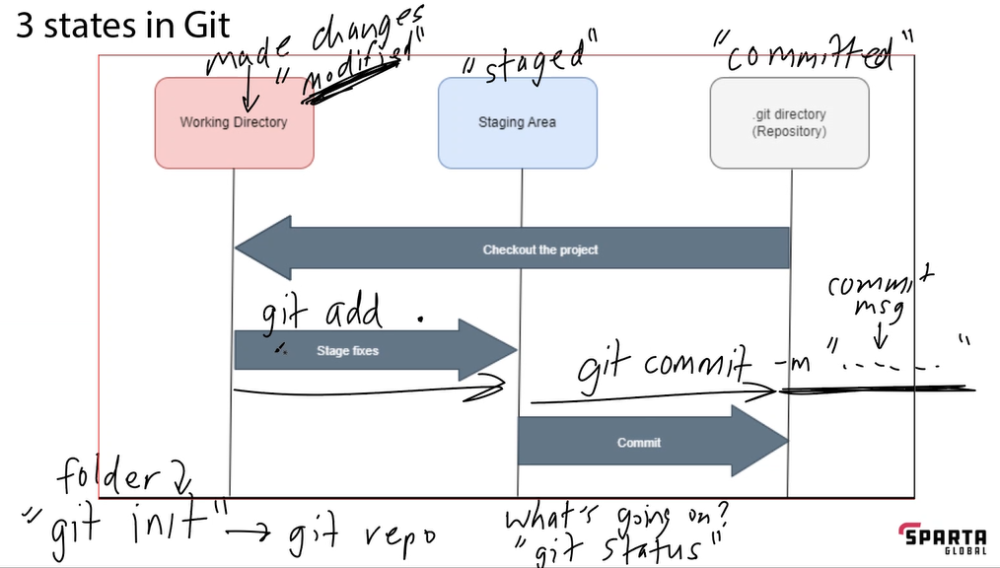

# Intro to Version Control & Git

## Version Control System
  * What is a Version Control System (VCS)
    - A system to record changes to file(s)
  
  * When to use one
    * Changes over a period time to files
  
  * Benefits
    * revert changes for files
    * compare changes over time
    * see who did what, when
    * when things go wrong, can rollback to a previous version
  
  * Types of version control
    * What is manual version control:
      * manually backing files + naming system(maybe)
      * dis: time consuming
    * How did early version control systems work
      * some were more labour intensive
      * some were just for tracking one file
      * base file + deltas => latest version of file
    
    * Centralised VCS vs Distributed VCS like Git
    
    
## Local Version Control with Git

  * What is stored in each version of a file that changes
  * Does Git need to be used as a distributed VCS
    * need a remote repo
  * What does Git store in a 'commit'
    * what you've staged 
  * The three states in Git
    * Modified
    * Staging
    * Committed

  * Where does Git store its information
    * . git folder in your git repo 
  * Common workflow of Git commands
    * once git initalised ('git init')
      1. git status 
      2. git add
      2. git commit -m message to summarise change

## Check differeneces between commits
- Use 'git log' to see a log of commits