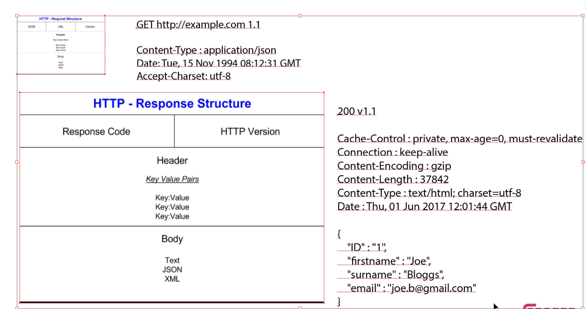
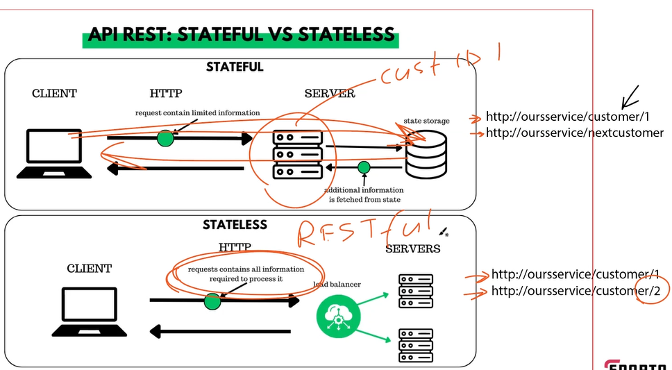

# APIs

## What is an API?
* Interface for software/services to be able to talk to each other
* Often gives access to resources such as:
  * data
  * images
  * videos
  * web pages
* Provide also all to ask for a certain action to be done

## Why might DevOps engineers need to use APIs?
* (automate) intractions with cloud services + infrastrucutre
* Integrate & manage DevOps tools & platforms
* Retrieve & manipulate data from external systems + services.

## RESTful services
* REST - Representational state transfer
* type of architecture used for the API
* primarly used to build web services which are lightweight and scaleable
* RESTful services use HTTP
* RESTful services should have following properties:
  * Representation and data flow
  * Messages
  * URIs / Naming resources
  * Statelessness
  * Caching

## HTTP messages and verbs
* GET
* POST
* PUT
* PATCH
* DELETE
* HTTP is protocol for internet communication
* HTTPS is the secure/encrypted version
* request/response system

| HTTP Verb | CRUD Operation |
|-----------|---------------|
| POST      | Create |
| GET       | Read |
| PUT       | Update – Complete replacement of a particular record |
| PATCH     | Update – Modify a specific piece of data |
| DELETE    | Delete |

## HTTP response structure and HTTP request structure

## API REST: Stateful vs Stateless:

## Cacheing

